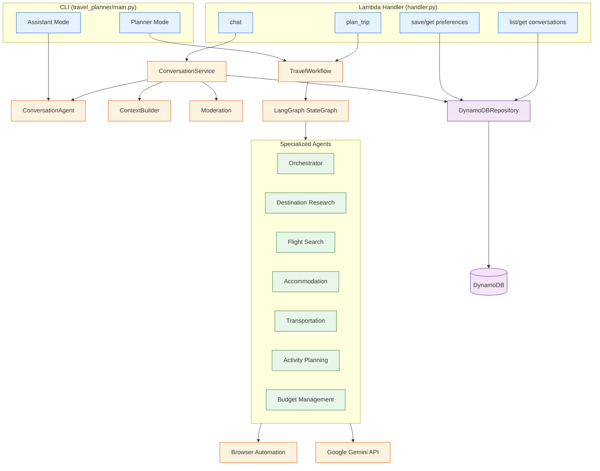
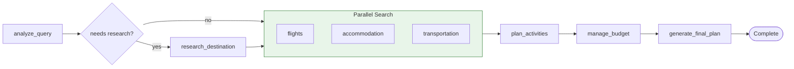
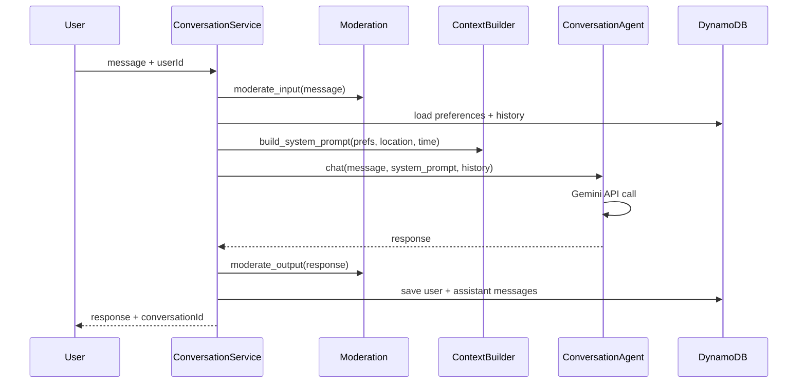

# Gemini Travel Graph

Multi-agent Japan travel planning system powered by Google Gemini and LangGraph workflow orchestration. Features a DynamoDB-backed AI conversation engine for personalized Japanese tourism recommendations.

Destinations are always Japan. Origin can be anywhere in the world.

## Two Modes

### Assistant Mode — AI Tourism Concierge

Interactive chat with **"Trip"**, an AI concierge specializing in Japan travel. Powered by `ConversationAgent` + `ContextBuilder`.

- **Preference-aware** — Dietary restrictions, travel style, cuisine types, budget level are treated as hard constraints
- **Location-aware** — GPS coordinates prioritize nearby spots
- **Time-aware** — Recommends places that are open now (morning breakfast spots, evening izakayas, etc.)
- **Conversation memory** — Full chat history persisted in DynamoDB per user/session
- **Content moderation** — Input validation + output PII scrubbing (emails, phone numbers)
- **Multilingual** — Responds in the same language the user writes in

### Planner Mode — Multi-Agent Trip Planning

Full trip planning workflow using LangGraph `StateGraph`. Six specialized agents collaborate through a directed graph:

1. **Orchestrator** — Analyzes the query and coordinates the pipeline
2. **Destination Research** — Researches Japan destinations using Tavily/Firecrawl
3. **Flight Search** — Finds flights from origin to Japan via browser automation
4. **Accommodation** — Searches hotels/ryokans at the destination
5. **Transportation** — Plans in-country transit (shinkansen, metro, buses)
6. **Activity Planning** — Builds daily itineraries matching preferences
7. **Budget Management** — Tracks costs, optimizes value, suggests alternatives

Flights, accommodation, and transportation run in **parallel** for faster results.

## Architecture



### Planner Workflow



Error handling and human-in-the-loop nodes attach as conditional edges to every main node.

### Assistant Conversation Flow



## Technology Stack

| Layer | Technology |
|-------|-----------|
| AI | [Google Gemini](https://ai.google.dev/) (`google-genai` SDK) |
| Orchestration | [LangGraph](https://github.com/langchain-ai/langgraph) `StateGraph` |
| Browser Automation | [Stagehand](https://github.com/browserbase/stagehand) (built on Playwright) |
| Data Persistence | [DynamoDB](https://aws.amazon.com/dynamodb/) (single-table design) |
| Research | [Tavily](https://tavily.com/), [Firecrawl](https://firecrawl.dev/) |
| Data Validation | [Pydantic v2](https://docs.pydantic.dev/) |
| Logging | [Loguru](https://github.com/Delgan/loguru) |
| Retry | [Tenacity](https://github.com/jd/tenacity) |
| Geolocation | [pygeohash](https://github.com/wdm0006/pygeohash) |
| Serverless | AWS Lambda |

## Installation

```bash
# Install dependencies (production)
pip install -r requirements.txt

# Install dependencies (development)
pip install -r requirements-dev.txt

# Set up environment variables
cp .env.example .env
# Edit .env with your API keys
```

### Required Environment Variables

| Variable | Description |
|----------|-------------|
| `GEMINI_API_KEY` | Google Gemini API key |
| `DYNAMODB_TABLE_NAME` | DynamoDB table name (default: `travel-planner`) |

### Optional Environment Variables

| Variable | Description |
|----------|-------------|
| `AWS_REGION` | AWS region (default: `ap-northeast-1`) |
| `DYNAMODB_ENDPOINT` | DynamoDB endpoint (set `http://localhost:8000` for local) |
| `TAVILY_API_KEY` | Tavily search API key (for destination research) |
| `FIRECRAWL_API_KEY` | Firecrawl API key (for web scraping) |
| `LOG_LEVEL` | `DEBUG` / `INFO` / `WARNING` / `ERROR` / `CRITICAL` |
| `HEADLESS` | Run browser in headless mode (`true`/`false`) |
| `CACHE_TTL` | Cache TTL in seconds (default: `3600`) |
| `MAX_CONCURRENCY` | Max concurrent operations (default: `3`) |

Each agent has its own model/temperature config via `[AGENT]_MODEL` and `[AGENT]_TEMPERATURE` env vars (e.g., `FLIGHT_MODEL=gemini-2.5-flash`, `FLIGHT_TEMPERATURE=0.4`). See `.env.example` for the full list.

### DynamoDB Setup

Single-table design with composite PK/SK keys and 1 GSI. The table is created automatically on first use.

```bash
# Local development with DynamoDB Local
docker run -p 8000:8000 amazon/dynamodb-local
```

## Usage

### Interactive (prompts for mode selection)

```bash
python -m travel_planner.main
```

### Assistant Mode

```bash
# Basic chat
python -m travel_planner.main --mode assistant

# With preferences and location context
python -m travel_planner.main --mode assistant \
  --preferences-file prefs.json \
  --location "35.6812,139.7671" \
  --timestamp "2026-03-15T19:00:00Z"
```

### Planner Mode

```bash
# With query
python -m travel_planner.main --mode planner \
  --query "Visit Tokyo for a week" \
  --origin "New York" \
  --budget "3000-5000"

# With specific dates
python -m travel_planner.main --mode planner \
  --query "Osaka food trip" \
  --origin "Seoul" \
  --departure-date 2026-04-01 \
  --return-date 2026-04-07 \
  --travelers 2
```

### CLI Options

| Flag | Mode | Description |
|------|------|-------------|
| `--mode` | Both | `assistant` or `planner` |
| `--preferences-file` | Both | Path to JSON preferences file |
| `--location` | Assistant | GPS as `lat,lng` |
| `--timestamp` | Assistant | ISO 8601 timestamp for time-aware recommendations |
| `--query` | Planner | Travel query string |
| `--origin` | Planner | Departure city or airport code |
| `--destination` | Planner | Destination in Japan |
| `--departure-date` | Planner | `YYYY-MM-DD` |
| `--return-date` | Planner | `YYYY-MM-DD` |
| `--travelers` | Planner | Number of travelers |
| `--budget` | Planner | Budget range (e.g., `1000-2000`) |
| `--headless` | Planner | Run browser in headless mode |
| `--no-cache` | Planner | Disable caching |
| `--save-to` | Planner | Save plan to file |
| `--format` | Planner | Output format: `json`, `text`, `html`, `pdf` |
| `--save-to-db` | Planner | Persist plan to DynamoDB |
| `--log-level` | Both | Logging level |
| `--init-db` | Both | Initialize DynamoDB table |

## User Preferences

Preferences drive personalized recommendations in both modes. Pass via `--preferences-file` (CLI) or `save_preferences` (Lambda).

Example `prefs.json`:

```json
{
  "travel_frequency": "MONTH_ONCE",
  "travel_styles": ["GOURMET", "NATURE"],
  "travel_purposes": ["HEALING"],
  "activity_style": "SPONTANEOUS",
  "cuisine_types": ["JAPANESE", "SEAFOOD", "LOCAL"],
  "budget_preference": "REASONABLE",
  "dietary_restrictions": ["NO_SPICY"],
  "beverage_types": ["SAKE", "BEER"],
  "dining_styles": ["LOCAL", "HIDDEN"],
  "activity_interests": ["ONSEN", "PHOTO", "GOURMET"],
  "custom_notes": "Loves cat cafes. Not a morning person."
}
```

Available preference categories:

| Category | Options |
|----------|---------|
| Travel Style | `SIGHTSEEING`, `GOURMET`, `NATURE`, `WORKATION`, `SOLO`, `FAMILY`, `COUPLE` |
| Travel Purpose | `HEALING`, `LEARNING`, `WORK`, `STUDY`, `SOCIAL`, `OSHI` |
| Activity Style | `ACTIVE`, `QUIET`, `PLANNED`, `SPONTANEOUS` |
| Cuisine | `JAPANESE`, `WESTERN`, `CHINESE`, `ASIAN`, `ITALIAN`, `FRENCH`, `SEAFOOD`, `NOODLE`, `SWEETS`, `LOCAL`, `B_GRADE`, `BBQ`, `STREET_FOOD`, `WILD_GAME`, `ETHNIC` |
| Dining Style | `FAMOUS`, `LOCAL`, `HIDDEN`, `STREET_FOOD`, `COURSE`, `BUFFET`, `BREAKFAST`, `NIGHT_DRINK`, `LUNCH_DRINK` |
| Budget | `REASONABLE`, `BALANCED`, `LUXURY`, `UNLIMITED` |
| Dietary | `NO_SPICY`, `NO_RAW`, `ALLERGIES`, `VEGETARIAN`, `VEGAN`, `HALAL`, `GLUTEN_FREE` |
| Beverages | `SAKE`, `SHOCHU`, `WINE`, `BEER`, `CAFE`, `COFFEE`, `TEA`, `NON_ALCOHOL`, `ALCOHOL_LOVER` |
| Activities | `GOURMET`, `ALCOHOL`, `PHOTO`, `HISTORY`, `THEME_PARK`, `CAFE`, `SHOPPING`, `NATURE`, `PARK`, `ONSEN`, `INSTAGRAMMABLE`, `CRAFTS`, `SPORTS`, `MUSIC` |

## Lambda API

The Lambda handler (`handler.py`) exposes these actions for backend integration:

| Action | Description | Key Params |
|--------|-------------|------------|
| `chat` | Send a message in assistant mode | `userId`, `message`, `conversationId`, `context.location`, `context.timestamp` |
| `plan_trip` | Run the full planner workflow | `userId`, `query`, `origin`, `destination`, `budget` |
| `save_preferences` | Save user preferences | `userId`, `preferences` |
| `get_preferences` | Get user preferences | `userId` |
| `list_conversations` | List user's conversations | `userId` |
| `get_conversation` | Get messages in a conversation | `conversationId` |

## Services

| Service | Description |
|---------|-------------|
| `ConversationService` | Orchestrates chat flow: load prefs, build context, call agent, moderate, save messages |
| `PlaceService` | Geohash-based proximity queries — finds nearby places using 9-cell neighbor search |
| `TokenTracker` | Records per-user per-day token usage (input/output counts) in DynamoDB |
| `ABTestService` | Deterministic prompt variant assignment (hash-based) with outcome tracking |
| `CacheService` | TTL-based caching for API responses |
| `Anonymizer` | Strips PII (emails, phone numbers) from log entries |

## Project Structure

```
travel_planner/
├── agents/                  # AI agents (each extends BaseAgent)
│   ├── base.py              # BaseAgent + AgentConfig
│   ├── orchestrator.py      # Query analysis and coordination
│   ├── destination_research.py
│   ├── flight_search.py
│   ├── accommodation.py
│   ├── transportation.py
│   ├── activity_planning.py
│   ├── budget_management.py
│   ├── conversation.py      # Assistant mode chat agent
│   ├── recommendation.py    # Spot/restaurant recommendations
│   └── research_tools.py    # Tavily + Firecrawl integration
├── orchestration/           # LangGraph workflow
│   ├── workflow.py          # TravelWorkflow entry point
│   ├── core/
│   │   ├── graph_builder.py # create_planning_graph()
│   │   └── agent_registry.py # Singleton agent registry
│   ├── nodes/               # Graph node functions
│   │   ├── query_analysis.py
│   │   ├── destination_research.py
│   │   ├── flight_search.py
│   │   ├── accommodation_search.py
│   │   ├── transportation_planning.py
│   │   ├── activity_planning.py
│   │   ├── budget_management.py
│   │   ├── parallel_search.py
│   │   └── final_plan.py
│   ├── routing/             # Conditional edge functions
│   ├── serialization/       # Checkpoint save/load
│   └── states/
│       ├── planning_state.py  # TravelPlanningState (Pydantic)
│       └── workflow_stages.py # WorkflowStage enum
├── browser/                 # Browser automation (Stagehand)
│   ├── automation.py        # BrowserAutomation base class
│   ├── caching.py           # Search result caching
│   ├── error_recovery.py    # Self-healing error recovery
│   └── websites/            # Site-specific scrapers
├── data/                    # Data layer
│   ├── models.py            # TravelQuery, TravelPlan, Flight, etc.
│   ├── dynamodb.py          # DynamoDB client (single-table)
│   ├── repository.py        # Repository pattern
│   ├── conversation_models.py # Session, Conversation, Message, Place
│   ├── preferences.py       # UserPreferences + enum types
│   └── storage.py
├── prompts/                 # Prompt engineering
│   ├── context.py           # ContextBuilder (system prompt assembly)
│   ├── templates.py         # Versioned prompt templates
│   └── moderation.py        # Input/output content moderation
├── services/                # Business logic
│   ├── conversation_service.py
│   ├── place_service.py
│   ├── token_tracker.py
│   ├── ab_testing.py
│   ├── cache_service.py
│   └── anonymizer.py
├── output/                  # Formatters
│   ├── itinerary.py
│   ├── budget.py
│   └── alternatives.py
├── utils/
│   ├── logging.py           # Loguru setup
│   ├── error_handling.py    # Custom exceptions + retry decorator
│   ├── rate_limiting.py     # API rate limiting + async HTTP client
│   └── helpers.py           # ID generation, currency formatting
├── config.py                # TravelPlannerConfig from env vars
└── main.py                  # CLI entry point
handler.py                   # AWS Lambda entry point
tests/
├── unit/                    # Unit tests (LangGraph mocked)
├── integration/
└── e2e/
```

## Development

```bash
# Run tests
python -m pytest

# Unit tests only
python -m pytest tests/unit/

# Single test
python -m pytest -k "test_name"

# Lint
ruff check .

# Format
ruff format .

# Type check
mypy .
```

- Python 3.12+
- Ruff for linting (rules: E, F, B, I, N, UP, PL, RUF) and formatting (line length 88)
- `pytest-asyncio` with `asyncio_mode = "auto"`
- LangGraph is mocked in unit tests (not available in test env)
- Gemini client is mocked via fixtures
