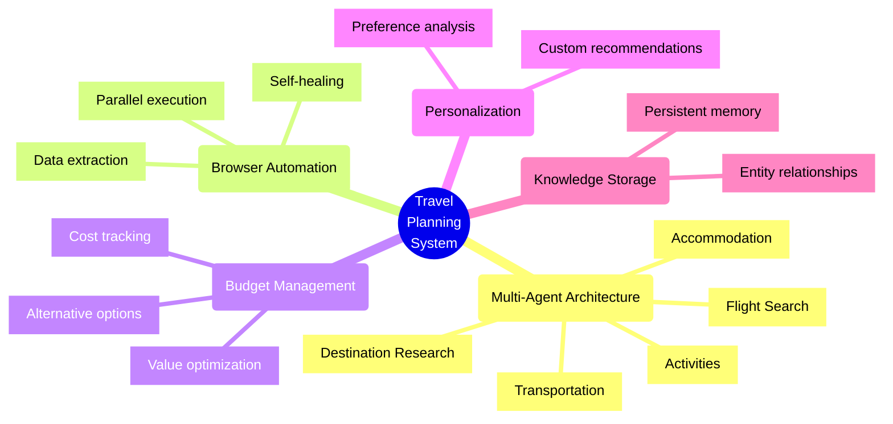
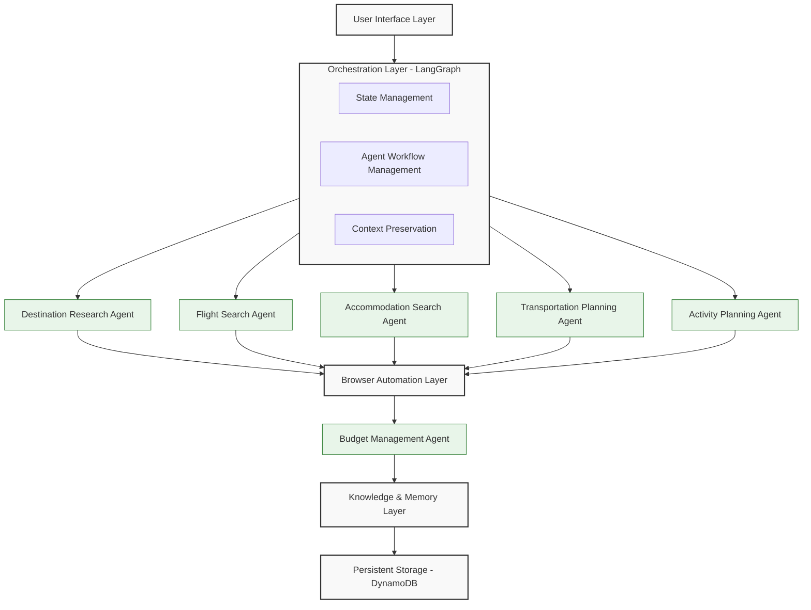
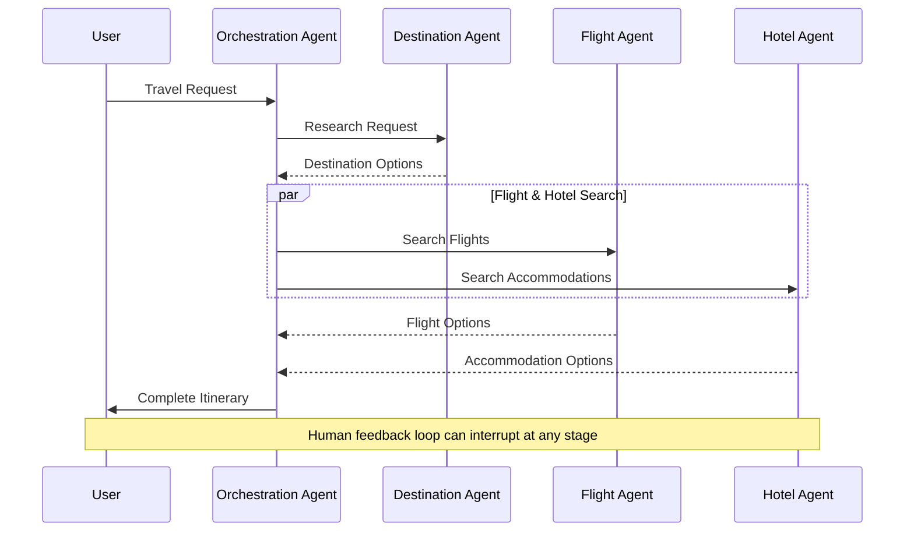

# Gemini Travel Graph

Multi-agent travel planning system powered by Google Gemini and LangGraph orchestration. Includes a DynamoDB-backed AI conversation engine for Japanese tourism recommendations.

## Overview

Two modes:
- **Assistant mode** — AI tourism concierge chat (ConversationAgent + ContextBuilder). Uses user preferences, GPS, and time-of-day for personalized Japan travel recommendations.
- **Planner mode** — Full trip planning workflow (LangGraph StateGraph). Agents research destinations, search flights/accommodation, plan activities, and manage budgets.

## Key Features



## Technology Stack

- **AI**: [Google Gemini](https://ai.google.dev/) (google-genai SDK)
- **Orchestration**: [LangGraph v0.4+](https://github.com/langchain-ai/langgraph)
- **Browser Automation**: [Stagehand v2.0+](https://github.com/browserbase/stagehand) (built on Playwright)
- **Data Persistence**: [DynamoDB](https://aws.amazon.com/dynamodb/) (single-table design, boto3)
- **Research**: [Tavily API](https://tavily.com/), [Firecrawl](https://firecrawl.dev/)

See [Architecture & Requirements](docs/architecture-requirements.md) for full details.

## System Architecture



### Agent Interaction Flow



## Installation

```bash
# Install dependencies (production)
pip install -r requirements.txt

# Install dependencies (development)
pip install -r requirements-dev.txt

# Set up environment variables
cp .env.example .env
# Edit .env with your API keys (GEMINI_API_KEY, DYNAMODB_TABLE_NAME)
```

### DynamoDB Setup

Single-table design. Configure via environment variables:

- `DYNAMODB_TABLE_NAME` — Table name (default: `travel-planner`)
- `AWS_REGION` — AWS region (default: `ap-northeast-1`)
- `DYNAMODB_ENDPOINT` — Set to `http://localhost:8000` for DynamoDB Local

```bash
docker run -p 8000:8000 amazon/dynamodb-local
```

The table is created automatically on first use.

## Usage

Interactive mode selection:

```bash
python -m travel_planner.main
```

Planner mode with query:

```bash
python -m travel_planner.main --mode planner --query "Visit Tokyo for a week" --origin "New York" --budget "3000-5000"
```

Assistant mode with preferences:

```bash
python -m travel_planner.main --mode assistant --preferences-file prefs.json
```

See `python -m travel_planner.main --help` for all options.

## Development

```bash
# Run tests
python -m pytest

# Lint
ruff check .

# Format
ruff format .

# Type check
mypy .
```

Dependencies are pinned in `requirements.txt` and `requirements-dev.txt`. Tool configs live in `pyproject.toml`.
